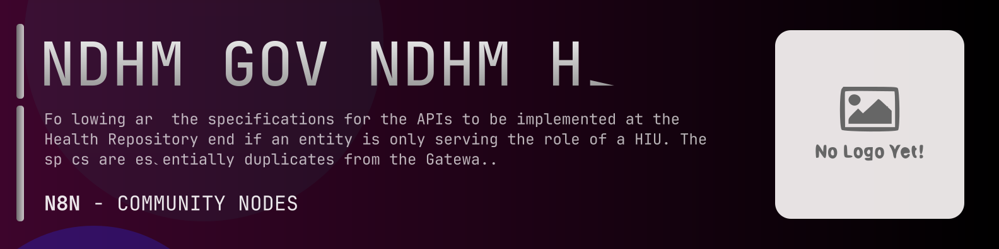

# @n8n-dev/n8n-nodes-ndhm-gov-ndhm-hiu



[](https://www.npmjs.com/package/@n8n-dev/n8n-nodes-ndhm-gov-ndhm-hiu)
[](https://opensource.org/licenses/MIT)

---

**Stop writing ndhm-gov-ndhm-hiu API integrations by hand.**

Every time you connect n8n to ndhm-gov-ndhm-hiu, you waste hours mapping endpoints, defining parameters, and debugging schemas. You copy-paste from docs, fix edge cases, and pray nothing breaks.

**What if connecting n8n to ndhm-gov-ndhm-hiu took 5 minutes, not half a day?**

This node gives you **7+ resources** out of the box: **User Auth**, **Identification**, **Consent Flow**, **Data Flow**, **Subscriptions**, and 2 more: with full CRUD operations, typed parameters, and zero manual configuration.

---

## What You Get

- **Zero boilerplate**: Resources, operations, and fields are pre-configured and ready to use
- **Full CRUD**: Create, read, update, and delete support where the API allows it
- **Typed parameters**: No more guessing field types
- **Built-in auth**: API key authentication, ready to go
- **Declarative**: Native n8n performance, no custom execute() overhead

---

## Install

```bash
npm install @n8n-dev/n8n-nodes-ndhm-gov-ndhm-hiu
```

**Or in n8n:**
1. **Settings → Community Nodes → Install**
2. Search: `@n8n-dev/n8n-nodes-ndhm-gov-ndhm-hiu`
3. Click **Install**

---

## Quick Start

1. Install the node (above)
2. Add credentials: **ndhm-gov-ndhm-hiu API** → paste your API key
3. Drag the **ndhm-gov-ndhm-hiu** node into your workflow
4. Pick a resource → pick an operation → done.

That's it. No configuration files. No code. It just works.

---

## Resources

| Resource | Operations |
|----------|------------|
| User Auth | Post notification api in case of direct mode of authentication by the cm, Post callback api for authconfirm in case of mediated auth to confirm user authentication or not, Post identification result for a consentmanager userid, Post response to user authentication initialization from hip |
| Identification | Post identification result for a consentmanager userid |
| Consent Flow | Post response to consent request, Post result of consent request status, Post consent notification, Post result of fetch request for a consent artefact |
| Data Flow | Post health information data request, Post health information transfer api |
| Subscriptions | Post notification for subscription grantdenyrevoke, Post callback api for the subscriptionrequestscminit to notify a hiu on acceptanceacknowledgement of the request for subscription, Post notification to hiu on basis of a granted subscription |
| Monitoring | Get consent request status |
| Gateway | Get openid configuration, Get certs for jwt verification, Post create consent request, Post get consent request status, Post get consent artefact, Post consent notification, Post health information data request, Post notifications corresponding to events during data flow, Post identify a patient by her consentmanager userid, Post get access token, Post request for subscription, Post callback api for subscriptionrequestshiunotify to acknowledge receipt of notification, Post callback api for subscriptionshiunotify to acknowledge receipt of notification, Post confirmation request sending token otp or other authentication details from hiphiu for confirmation, Post get a patients authentication modes relevant to specified purpose, Post initialize authentication from hip, Post callback api by hiuhips as acknowledgement of auth notification |

---

## Why This Node?

**Without this node:**
- Hours of manual API integration
- Copy-pasting from ndhm-gov-ndhm-hiu docs
- Debugging auth, pagination, error handling
- Maintaining your own client code

**With this node:**
- Install → configure → use. 5 minutes.
- Auto-generated from the official ndhm-gov-ndhm-hiu OpenAPI spec
- Always up to date when the API changes
- Native n8n performance

---

## Auto-Generated
This node was auto-generated from the official **ndhm-gov-ndhm-hiu** OpenAPI specification using
[@n8n-dev/n8n-openapi-node-ultimate](https://github.com/kelvinzer0/n8n-openapi-node-ultimate),
then validated against the live API so you get accurate types and real parameters, not guesswork.

When the ndhm-gov-ndhm-hiu API updates, this node updates too.

---

## Support This Project

If this node saved you hours of work, consider supporting continued development, new APIs, better error handling, and faster updates.

[](https://n8n-code.github.io/membership/#/eyJ0aXRsZSI6IktlZXAgSXQgTW92aW5nIiwiZGVzYyI6Ik9uZSBkZXZlbG9wZXIgYnVpbHQgYSB0b29sIHRoYXQgYXV0by1nZW5lcmF0ZXNcbm44biBub2RlcyBmcm9tIGFueSBPcGVuQVBJIHNwZWMuXG5cbllvdXIgZG9uYXRpb24gZnVuZHMgbmV3IGZlYXR1cmVzLCBtb3JlIEFQSSBzdXBwb3J0LFxuYW5kIGJldHRlciB0b29saW5nIGZvciBldmVyeSBkZXZlbG9wZXIgYWZ0ZXIgeW91LiIsInRhcmdldCI6NTAwMCwiYWRkcmVzc2VzIjp7ImV0aGVyZXVtIjoiMHhmMDU1NWQ0MGRiRkI0ZTNCZjA3MDQ0MjgyQjc4RjJmRTFmNTFFZjcyIiwic29sYW5hIjoiNlpEVk5BYmpZZExEcXo4cGt3VUNHYllaNVV3QlFranB0QzU1Wk5vTFcybVUifSwiZGlzY29yZCI6Imh0dHBzOi8vZGlzY29yZC5nZy9wdERaOGU0aDkzIn0)

---

## License

MIT © [kelvinzer0](https://github.com/n8n-code)
